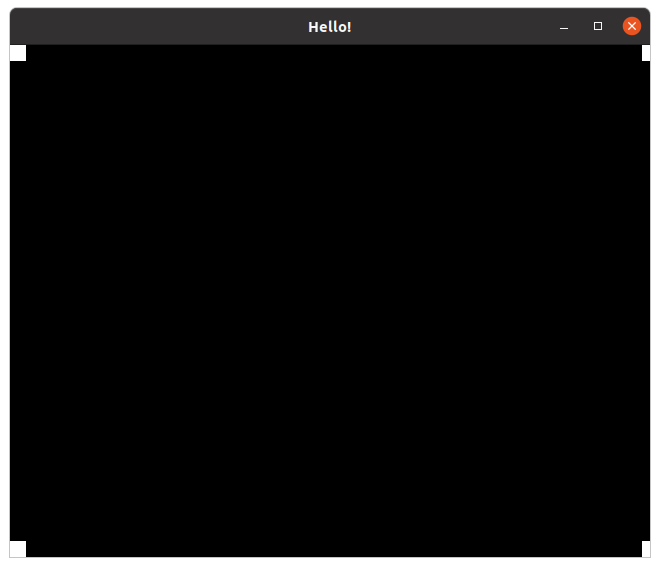

Terra\_CHIP8
============

[CHIP-8](https://en.wikipedia.org/wiki/CHIP-8) emulator written in [Terra](http://terralang.org/index.html) and Lua. Inspired by the article by Laurence Muller http://www.multigesture.net/articles/how-to-write-an-emulator-chip-8-interpreter/

Using [libcaca](http://caca.zoy.org/wiki/libcaca) to display things because I can. :joy:



Status: far from being functional

You will need to install libcaca and http://terralang.org/

To run just do $ terra main.t

If you will use Terra for Linux you will probably need Ubuntu 16.04.

test\_caca.c is just a test program I wrote to get the hang of libcaca, to build it you will need cmake

```bash
mkdir build
cd build
cmake ..
make
```
